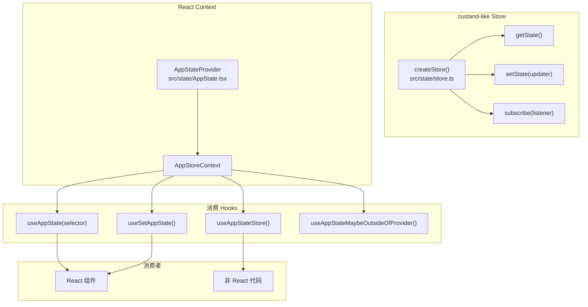
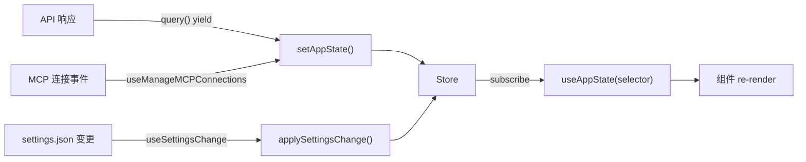

# 7.1 状态管理

> 前置：[6.2 QueryEngine](/ch06-heartbeat/query-engine)
>
> 源码位置：`src/state/` (1190 行)

Claude Code 有两套状态系统：全局可变的 bootstrap/state（进程级基础设施）和不可变的 AppState（UI 级响应式）。本节聚焦 AppState——React 组件树的核心数据源。

## 架构总览



## store.ts — 极简 zustand

`createStore()` 只有 34 行，实现了 zustand 的核心子集：

```typescript
export type Store<T> = {
  getState: () => T
  setState: (updater: (prev: T) => T) => void
  subscribe: (listener: () => void) => () => void
}
```

关键设计：

- **不可变更新**：`setState` 接受 updater 函数，通过 `Object.is(next, prev)` 去重
- **浅比较**：状态对象整体替换而非合并，selector 用 `Object.is` 判断变化
- **onChange 回调**：可选的 `onChange` 在状态变更时触发（用于日志、持久化等）

## AppState 类型结构

AppState 是一个大型不可变 record，包含以下核心域：

| 域 | 关键字段 | 用途 |
|----|----------|------|
| **消息** | `messages: Message[]` | 完整对话历史 |
| **工具权限** | `toolPermissionContext` | 权限模式、可绕过状态 |
| **模型** | `mainLoopModel`, `modelStrings` | 当前模型和可用模型 |
| **MCP** | `mcpConnections` | MCP 服务器连接状态 |
| **Agent** | `agentDefinitions` | 已加载的 Agent 定义 |
| **插件** | `plugins` | 已安装/启用的插件 |
| **Speculation** | `speculationState` | 预测执行状态 |
| **权限** | `permissionMode` | 当前权限模式 |
| **思考** | `thinkingEnabled` | Thinking 开关 |
| **任务** | `tasks` | 后台任务状态 |

## 状态流转



## AppStateProvider

Provider 层的关键职责：

1. **创建 Store**：`useState(() => createStore(initialState, onChange))`，确保单例
2. **禁止嵌套**：通过 `HasAppStateContext` 检测嵌套 Provider 并抛错
3. **远程设置同步**：`useSettingsChange` 监听 settings.json 变更并同步到 Store
4. **Bypass 权限检查**：mount 时检查是否应禁用 bypass 权限模式

```tsx
<AppStateProvider>
  <MailboxProvider>
    <VoiceProvider>   {/* Ant-only, passthrough externally */}
      {children}
    </VoiceProvider>
  </MailboxProvider>
</AppStateProvider>
```

## useAppState — 精确订阅

```typescript
// 只订阅需要的切片，避免无关 re-render
const verbose = useAppState(s => s.verbose)
const model = useAppState(s => s.mainLoopModel)

// 错误：返回新对象会导致无限 re-render
// const { text, id } = useAppState(s => ({ text: s.text, id: s.id }))

// 正确：返回已有子对象引用
const { text, promptId } = useAppState(s => s.promptSuggestion)
```

底层使用 `useSyncExternalStore` 实现——React 18+ 的并发安全外部 store 订阅 API。

## 关键源文件

| 文件 | 行数 | 职责 |
|------|------|------|
| `src/state/store.ts` | 34 | createStore 极简 zustand 实现 |
| `src/state/AppStateStore.ts` | 569 | AppState 类型定义 + getDefaultAppState |
| `src/state/AppState.tsx` | 199 | AppStateProvider + useAppState hooks |
| `src/state/onChangeAppState.ts` | 171 | 状态变更回调处理 |
| `src/state/selectors.ts` | 76 | 常用 selector 函数 |
| `src/state/teammateViewHelpers.ts` | 141 | Swarm 队友视图辅助 |

---

<div class="chapter-nav-hint">

**下一节：[7.2 Agent/Subagent 系统 →](/ch07-extensions/agents)**

</div>
