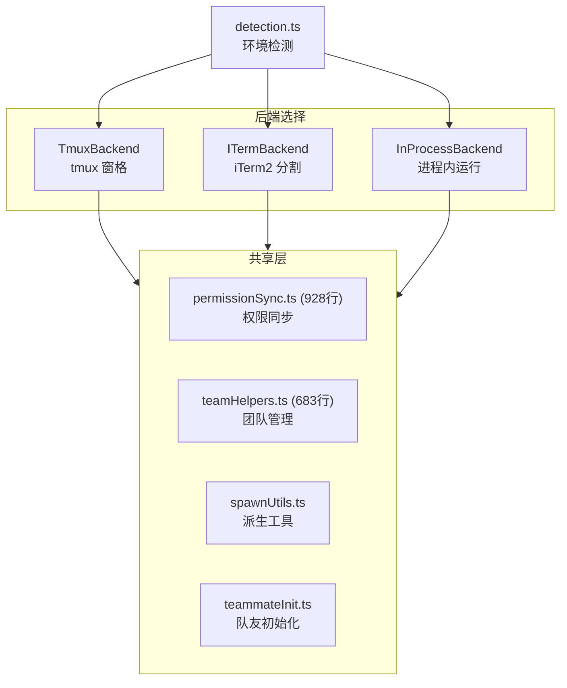
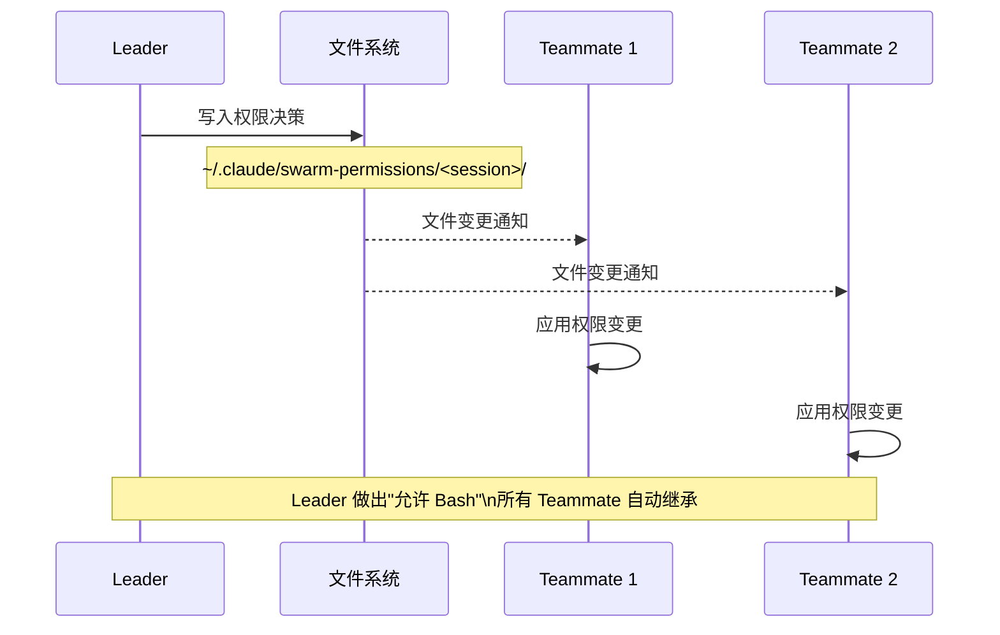

# 7.3 Swarm 多智能体

> 前置：[7.2 Agent/Subagent 系统](/ch07-extensions/agents)
>
> 源码位置：`src/utils/swarm/` (4107 行, 12+ 文件) + `src/utils/swarm/backends/`

Swarm 是 Claude Code 的多 Agent 协作框架——允许多个 Claude 实例作为"队友"并行工作，各自拥有独立的终端窗格、权限上下文和对话状态。

## 三种后端



| 后端 | 适用场景 | 窗格管理 | 特点 |
|------|----------|----------|------|
| **Tmux** | SSH/远程服务器 | tmux split-window | 最通用，服务器标配 |
| **iTerm2** | macOS 本地开发 | iTerm2 AppleScript | 原生体验，支持分屏 |
| **InProcess** | 测试/嵌入式 | 无窗格 | 同进程运行，无终端 UI |

## 权限同步 (permissionSync.ts)

928 行的权限同步是 Swarm 最复杂的子系统——确保 Leader 的权限决策在所有 Teammate 间实时生效：



同步内容包括：

- 工具权限决策（允许/拒绝/始终允许）
- 权限模式切换（normal/plan/bypass）
- 文件写入权限继承
- Leader 的 `leaderPermissionBridge.ts` 连接 Swarm 权限到主进程

## 团队管理 (teamHelpers.ts)

683 行的团队管理处理队友生命周期：

| 功能 | 说明 |
|------|------|
| 队友创建 | 为新队友分配颜色、名称、角色 |
| 队友发现 | 扫描已有队友进程 |
| 心跳检测 | 监控队友存活状态 |
| 队友移除 | 优雅关闭队友进程 |
| 状态聚合 | 收集所有队友的进度信息 |

## 颜色与命名系统

每个 Teammate 分配唯一颜色用于终端区分：

```
Leader (蓝)     ── 驱动任务分配
  ├── Researcher (绿)  ── 代码探索
  ├── Coder (黄)       ── 代码实现
  └── Reviewer (红)    ── 代码审查
```

颜色通过 `agentColorManager.ts` 管理，确保不重复。

## InProcess 运行器 (inProcessRunner.ts)

1552 行——最大的单文件，处理进程内 Swarm 模式：

- 无需外部终端模拟器
- 队友在同一 Node.js 进程中运行
- 通过内存通道通信而非文件系统
- 适用于测试和嵌入式场景

## vs Coordinator 模式

| 特性 | Swarm | Coordinator |
|------|-------|-------------|
| 架构 | Leader + Teammates | Coordinator + Workers |
| 通信 | 文件系统 + 权限桥 | Scratchpad 共享目录 |
| 终端 | 多窗格独立终端 | 单终端 + 后台 Worker |
| 权限 | Leader 统一决策 | Coordinator 委派 |
| 适用 | 长时间并行任务 | 任务分解型编排 |
| 入口 | `/team` 命令 | `COORDINATOR_MODE` feature gate |

## 关键源文件

| 文件 | 行数 | 职责 |
|------|------|------|
| `src/utils/swarm/inProcessRunner.ts` | 1552 | 进程内 Swarm 运行器 |
| `src/utils/swarm/permissionSync.ts` | 928 | 跨进程权限同步 |
| `src/utils/swarm/teamHelpers.ts` | 683 | 团队管理 |
| `src/utils/swarm/spawnInProcess.ts` | 328 | 进程内派生 |
| `src/utils/swarm/teammateLayoutManager.ts` | 107 | 队友布局管理 |
| `src/utils/swarm/spawnUtils.ts` | 146 | 派生工具函数 |
| `src/utils/swarm/teammateInit.ts` | 129 | 队友初始化 |
| `src/utils/swarm/leaderPermissionBridge.ts` | 54 | Leader 权限桥接 |
| `src/utils/swarm/reconnection.ts` | 119 | 断线重连 |
| `src/utils/swarm/backends/TmuxBackend.ts` | - | Tmux 后端 |
| `src/utils/swarm/backends/ITermBackend.ts` | - | iTerm2 后端 |
| `src/utils/swarm/backends/InProcessBackend.ts` | - | 进程内后端 |

---

<div class="chapter-nav-hint">

**下一节：[7.4 Compact 上下文管理 →](/ch07-extensions/compact)**

</div>
