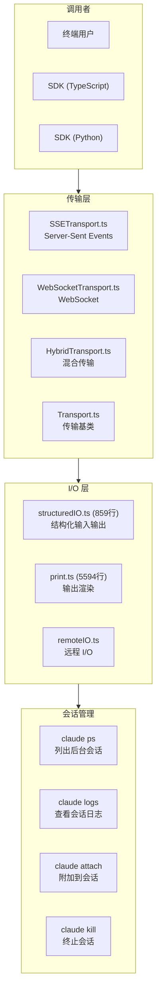
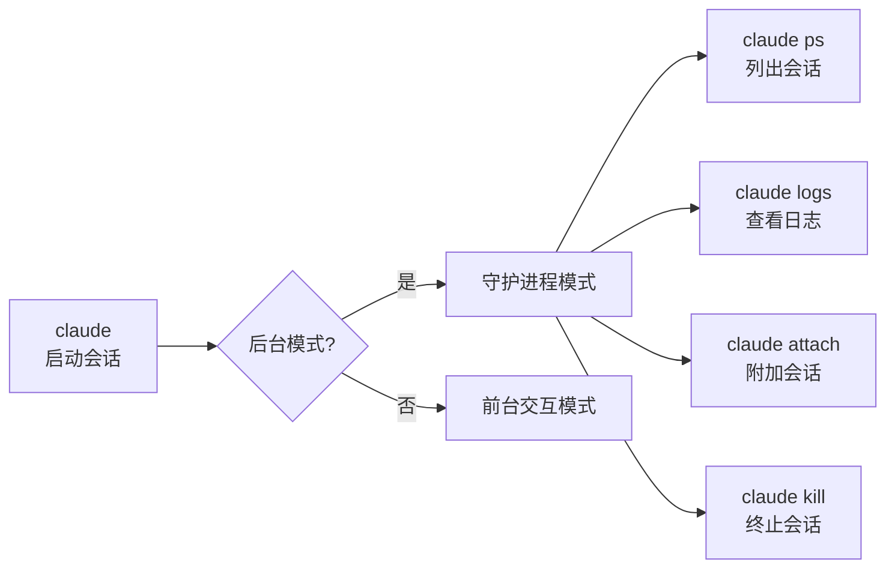

# 8.2 CLI/SDK 接口

> 前置：[8.1 UI 系统](/ch08-interfaces/ui-system)
>
> 源码位置：`src/cli/` (7193 行, 7 文件) + `src/cli/transports/`

CLI/SDK 接口是 Claude Code 的"外部 API"——无论是终端用户还是程序化调用者，都通过这一层与系统交互。它处理传输协议、结构化 I/O、输出渲染和后台会话管理。

## 架构总览



## 传输层

三种传输协议满足不同场景需求：

| 传输 | 实现 | 适用场景 | 特点 |
|------|------|----------|------|
| **SSE** | `SSETransport.ts` | 服务器推送、单向流 | HTTP 长连接，兼容性好 |
| **WebSocket** | `WebSocketTransport.ts` | 双向实时通信 | 低延迟，全双工 |
| **Hybrid** | `HybridTransport.ts` | SSE + WebSocket 混合 | 兼顾兼容性和性能 |

```mermaid
sequenceDiagram
    participant C as Client
    participant T as Transport
    participant S as Claude Code Server

    C->>T: connect()
    T->>S: 建立连接

    alt SSE 模式
        S-->>C: EventStream (单向推送)
        C->>S: HTTP POST (发送消息)
    else WebSocket 模式
        S<->>C: 双向消息流
    else Hybrid 模式
        S-->>C: SSE (事件流)
        C<->>S: WebSocket (双向操作)
    end
```

辅助模块：

- `ccrClient.ts`：CCR (Claude Code Remote) 客户端
- `transportUtils.ts`：传输工具函数
- `SerialBatchEventUploader.ts`：批量事件上传
- `WorkerStateUploader.ts`：Worker 状态上传

## structuredIO.ts — 结构化 I/O

859 行的结构化 I/O 处理 SDK 模式下的消息序列化：

| 功能 | 说明 |
|------|------|
| **消息格式化** | 将内部 Message 转换为 SDKMessage |
| **事件流** | 生成结构化事件流（JSON Lines） |
| **错误封装** | 统一错误格式 |
| **状态同步** | SDKStatus 更新推送 |

SDK 消息类型映射：

```typescript
// 内部 Message → SDKMessage
// UserMessage      → SDKUserMessage
// AssistantMessage → SDKAssistantMessage
// ToolUseSummary   → SDKToolUseMessage
// SystemMessage    → SDKSystemMessage
// ...
```

## print.ts — 输出渲染

5594 行的 print.ts 是最大的输出渲染文件，负责将内部状态渲染为终端文本：

| 渲染功能 | 说明 |
|----------|------|
| 消息渲染 | 将各类型 Message 渲染为终端友好格式 |
| 工具输出 | Bash 输出、文件差异、搜索结果 |
| 成本显示 | token 用量、费用统计 |
| 进度条 | 工具执行进度 |
| 错误输出 | API 错误、权限错误 |
| 状态栏 | 模型、模式、上下文使用率 |

## 后台会话管理

Claude Code 支持后台运行会话（`BG_SESSIONS` feature gate）：



| 命令 | 功能 |
|------|------|
| `claude ps` | 列出所有运行中的后台会话 |
| `claude logs <id>` | 查看指定会话的日志输出 |
| `claude attach <id>` | 附加到指定会话的交互界面 |
| `claude kill <id>` | 终止指定会话 |

## 关键源文件

| 文件 | 行数 | 职责 |
|------|------|------|
| `src/cli/print.ts` | 5594 | 终端输出渲染 |
| `src/cli/structuredIO.ts` | 859 | 结构化 I/O 处理 |
| `src/cli/remoteIO.ts` | 255 | 远程 I/O |
| `src/cli/update.ts` | 422 | 自动更新 |
| `src/cli/exit.ts` | 31 | 退出处理 |
| `src/cli/transports/SSETransport.ts` | - | SSE 传输 |
| `src/cli/transports/WebSocketTransport.ts` | - | WebSocket 传输 |
| `src/cli/transports/HybridTransport.ts` | - | 混合传输 |
| `src/cli/transports/Transport.ts` | - | 传输基类 |
| `src/cli/transports/ccrClient.ts` | - | CCR 客户端 |

---

<div class="chapter-nav-hint">

**下一节：[8.3 远程与 CCR →](/ch08-interfaces/remote-ccr)**

</div>
