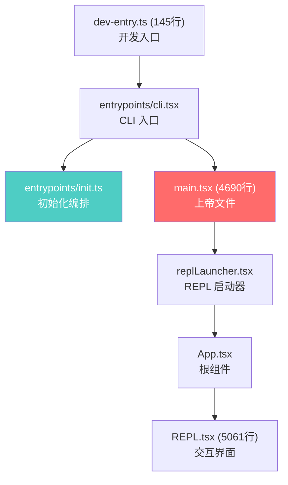
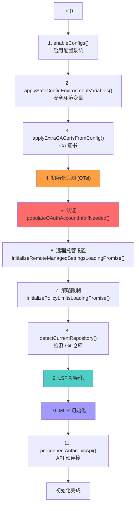
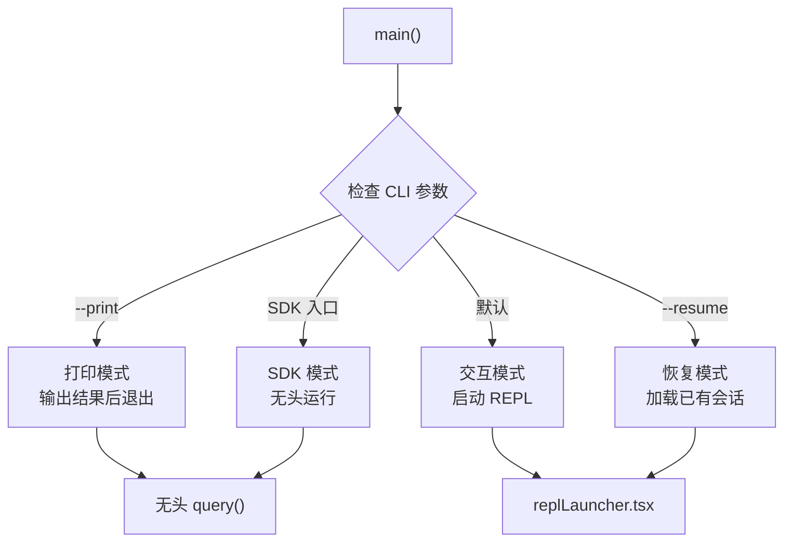

# 8.5 完整入口流

> 前置：[8.4 LSP 集成](/ch08-interfaces/lsp)
>
> 源码位置：`src/dev-entry.ts` + `src/entrypoints/` + `src/main.tsx`

从用户键入 `claude` 到 REPL 交互界面出现，经过一条精心编排的初始化链路。理解这条链路，就理解了 Claude Code 的启动时序和各子系统的初始化依赖关系。

## 入口链路总览



## dev-entry.ts — 开发入口

145 行的开发入口做三件事：

1. **版本检查**：`--version` 打印版本号
2. **帮助信息**：`--help` 打印用法
3. **导入检测**：扫描 `src/` 和 `vendor/` 中的相对导入，报告缺失模块
4. **转发**：当缺失导入为 0 时，转发到 `entrypoints/cli.tsx`

这是从 source map 恢复的开发工作区入口——检测恢复完整性后委托给正式入口。

## init.ts — 初始化编排

`init.ts` 是启动时序的编排者，使用 `memoize` 确保只执行一次：



### 关键初始化步骤详解

| 步骤 | 模块 | 作用 | 失败影响 |
|------|------|------|----------|
| **配置** | `utils/config.ts` | 验证并启用 settings.json | 致命：无法继续 |
| **安全环境变量** | `utils/managedEnv.ts` | 仅应用安全的环境变量覆盖 | 低：部分功能受限 |
| **CA 证书** | `utils/caCertsConfig.ts` | 注入自定义 CA 证书到 TLS | 低：HTTPS 可能失败 |
| **遥测** | OTel | 初始化 meter/tracer/logger | 低：无遥测数据 |
| **认证** | `services/oauth/` | OAuth 账户信息填充 | 中：API 调用受限 |
| **远程设置** | `services/remoteManagedSettings/` | 异步加载远程管理设置 | 低：使用本地默认值 |
| **策略限制** | `services/policyLimits/` | 异步加载使用限制 | 低：使用默认限制 |
| **仓库检测** | `utils/detectRepository.ts` | 检测 Git 仓库和远程 | 低：无 Git 上下文 |
| **LSP** | `services/lsp/` | 启动语言服务器 | 低：无诊断反馈 |
| **MCP** | `services/mcp/` | 连接 MCP 服务器 | 低：无外部工具 |
| **API 预连接** | `utils/apiPreconnect.ts` | DNS + TLS 握手预热 | 低：首次请求稍慢 |

### 异步初始化

部分步骤使用"Loading Promise"模式——立即返回 Promise，后台异步完成：

```typescript
// 远程设置和策略限制使用此模式
const settingsPromise = initializeRemoteManagedSettingsLoadingPromise()
const policyPromise = initializePolicyLimitsLoadingPromise()

// 后续代码可以在需要时 await
await waitForRemoteManagedSettingsToLoad()
```

## main.tsx — 上帝文件

4690 行的 main.tsx 是整个应用的"瑞士军刀"，职责极其广泛：

| 职责域 | 说明 |
|--------|------|
| **入口分发** | 根据 CLI 参数选择 REPL/SDK/Headless/Remote 模式 |
| **会话管理** | 创建/恢复/切换会话 |
| **Query 集成** | 将 query() 连接到 REPL |
| **权限系统** | 初始化权限上下文和模式 |
| **工具注册** | 注册所有可用工具 |
| **MCP 管理** | 管理 MCP 连接生命周期 |
| **Hook 系统** | 注册生命周期钩子 |
| **自动更新** | 检查和应用更新 |
| **会话持久化** | 保存/恢复会话状态 |
| **信号处理** | SIGINT/SIGTERM 优雅关闭 |
| **诊断** | 收集和报告运行时诊断 |

### 入口分发逻辑



### 信号处理

main.tsx 注册了优雅关闭处理器：

- **SIGINT (Ctrl+C)**：第一次中断当前操作，第二次退出
- **SIGTERM**：优雅关闭所有子进程
- **SIGHUP**：保存会话状态后退出

## replLauncher.tsx → App.tsx → REPL.tsx

启动链的最后三步：

1. **replLauncher.tsx**：创建 Ink 渲染器实例，挂载 React 树
2. **App.tsx**：根组件——包裹 `AppStateProvider`、`AutoUpdater`、权限上下文等
3. **REPL.tsx**：主交互界面——消息列表 + PromptInput + 工具执行面板

```tsx
// 简化的组件树
<AppStateProvider>
  <AutoUpdater>
    <PermissionProvider>
      <MCPProvider>
        <REPL />    {/* 5061 行的主 UI */}
      </MCPProvider>
    </PermissionProvider>
  </AutoUpdater>
</AppStateProvider>
```

## 启动性能优化

Claude Code 的启动时序经过精心优化：

| 优化手段 | 实现 |
|----------|------|
| **懒加载** | 消息选择器、Skill 搜索等使用 dynamic import |
| **异步初始化** | 远程设置、策略限制使用 Promise 不阻塞 |
| **预连接** | API DNS+TLS 握手在 init 期间启动 |
| **DCE** | `feature('X')` 编译时消除不需要的代码 |
| **缓存** | MCP 配置、插件列表使用缓存避免重复加载 |

## 关键源文件

| 文件 | 行数 | 职责 |
|------|------|------|
| `src/main.tsx` | 4690 | 主入口，"上帝文件" |
| `src/dev-entry.ts` | 145 | 开发入口，恢复检查 |
| `src/entrypoints/cli.tsx` | - | CLI 入口 |
| `src/entrypoints/init.ts` | - | 初始化编排 |
| `src/entrypoints/agentSdkTypes.ts` | - | SDK 类型定义 |
| `src/components/App.tsx` | - | 根组件 |
| `src/components/REPL.tsx` | 5061 | 主交互界面 |

---

<div class="chapter-nav-hint">

**下一节：[附录 — 隐藏功能目录 →](/appendix-hidden/buddy)**

</div>
