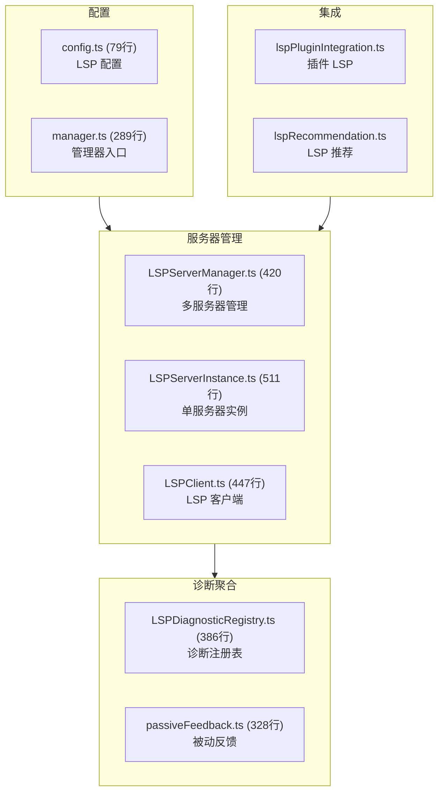
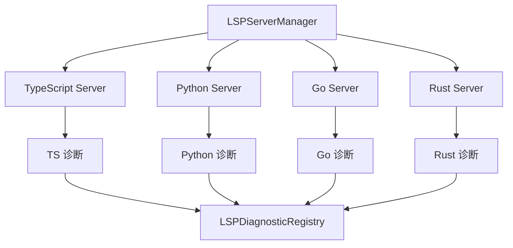
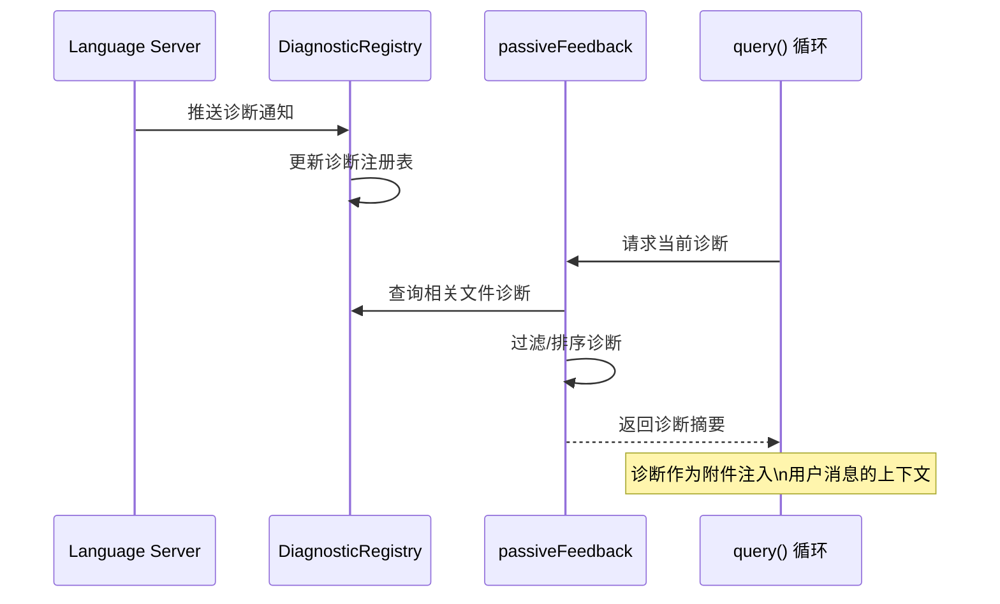

# 8.4 LSP 集成

> 前置：[8.3 远程与 CCR](/ch08-interfaces/remote-ccr)
>
> 源码位置：`src/services/lsp/` (2462 行, 8 文件)

LSP (Language Server Protocol) 集成让 Claude Code 获得语言感知能力——实时获取诊断信息、类型定义和代码结构。与传统的 IDE 不同，Claude Code 以"被动反馈"方式使用 LSP：不主动触发分析，而是消费 LSP 推送的诊断结果。

## 架构总览



## 多服务器管理

`LSPServerManager.ts` 管理多个语言服务器实例：

| 操作 | 说明 |
|------|------|
| 发现 | 扫描项目确定需要哪些语言服务器 |
| 启动 | 按需启动语言服务器进程 |
| 监控 | 监控服务器健康状态 |
| 重启 | 崩溃后自动重启 |
| 关闭 | 会话结束时优雅关闭 |

每个语言对应一个 `LSPServerInstance`：



## LSPServerInstance — 单服务器实例

511 行的 `LSPServerInstance.ts` 封装单个语言服务器：

1. **进程管理**：启动/停止语言服务器子进程
2. **协议通信**：通过 stdio 与语言服务器交换 LSP 消息
3. **能力协商**：初始化时交换服务器能力
4. **文件追踪**：通知服务器文件打开/关闭/修改
5. **诊断收集**：接收服务器推送的诊断通知

## 诊断聚合

`LSPDiagnosticRegistry.ts` (386 行) 聚合所有语言服务器的诊断：

| 字段 | 类型 | 说明 |
|------|------|------|
| `uri` | string | 文件 URI |
| `diagnostics` | Diagnostic[] | 诊断列表 |
| `source` | string | 来源服务器 |
| `timestamp` | number | 更新时间 |

诊断类型：

```typescript
interface Diagnostic {
  range: Range           // 代码范围
  severity: Severity     // 错误/警告/信息/提示
  message: string        // 诊断消息
  source?: string        // 来源（如 "ts", "pyright"）
  code?: string | number // 诊断代码
}
```

## 被动反馈 (passiveFeedback.ts)

328 行的被动反馈是 LSP 集成的核心创新——将诊断信息自动注入对话上下文：



被动反馈的工作方式：

1. **不主动请求**：不会触发 LSP 分析，只消费已有结果
2. **自动附加**：当用户提到文件时，自动附加该文件的诊断
3. **智能过滤**：只附加与当前对话相关的诊断
4. **格式化**：将 LSP 诊断格式化为 Claude 可理解的文本

## LSP 配置

`config.ts` (79 行) 定义 LSP 配置格式：

```typescript
type LSPConfig = {
  servers: {
    [language: string]: {
      command: string       // 启动命令
      args?: string[]       // 命令参数
      env?: Record<string, string>  // 环境变量
    }
  }
}
```

配置来源：

- 项目 `.claude/settings.json` 中的 `lsp` 字段
- 插件通过 `lspPluginIntegration.ts` 注册
- 自动推荐通过 `lspRecommendation.ts` 发现

## 关键源文件

| 文件 | 行数 | 职责 |
|------|------|------|
| `src/services/lsp/LSPServerInstance.ts` | 511 | 单语言服务器实例 |
| `src/services/lsp/LSPServerManager.ts` | 420 | 多服务器管理 |
| `src/services/lsp/LSPClient.ts` | 447 | LSP 客户端协议 |
| `src/services/lsp/LSPDiagnosticRegistry.ts` | 386 | 诊断聚合注册表 |
| `src/services/lsp/passiveFeedback.ts` | 328 | 被动反馈注入 |
| `src/services/lsp/manager.ts` | 289 | LSP 管理器入口 |
| `src/services/lsp/config.ts` | 79 | LSP 配置 |
| `src/services/lsp/types.ts` | 2 | 类型导出 |

---

<div class="chapter-nav-hint">

**下一节：[8.5 完整入口流 →](/ch08-interfaces/entry-flow)**

</div>
