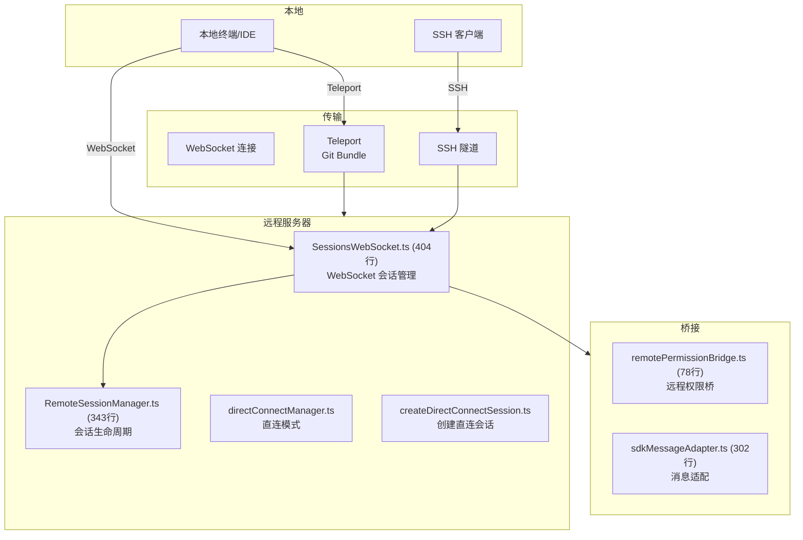
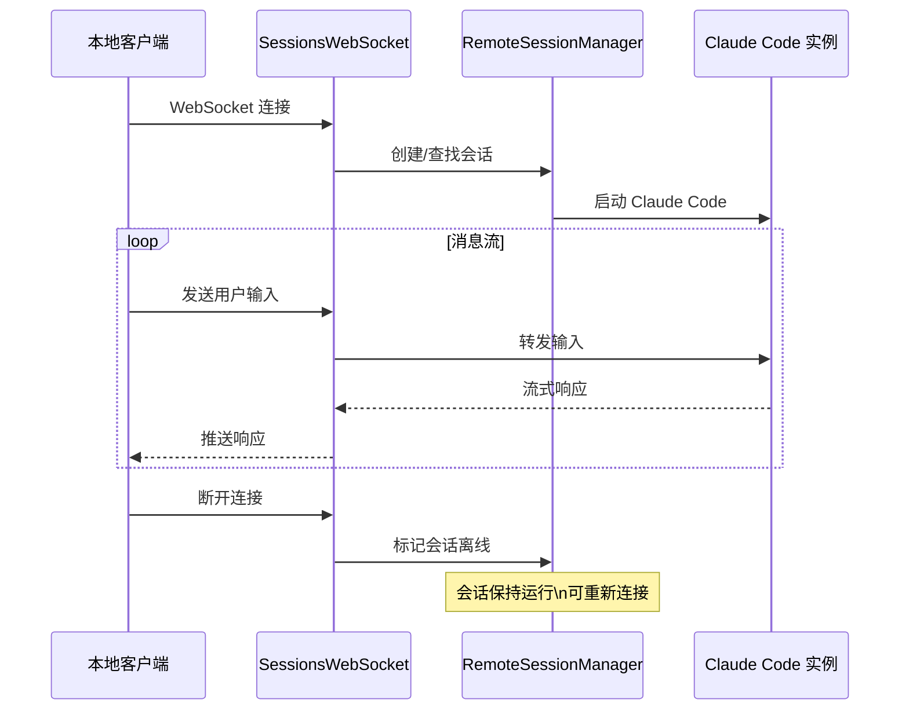
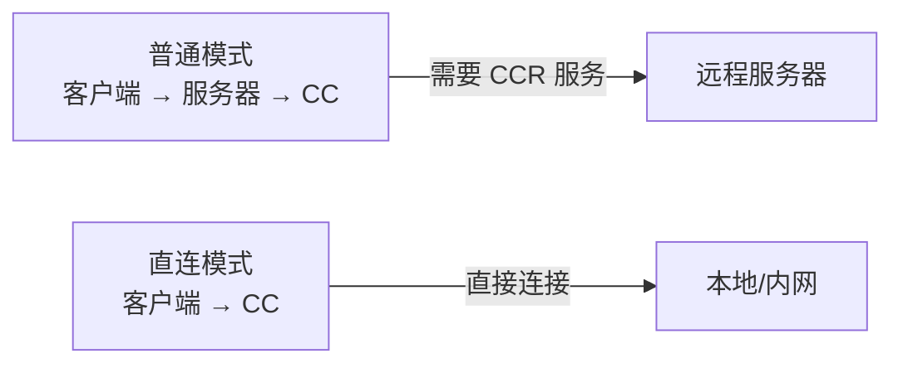
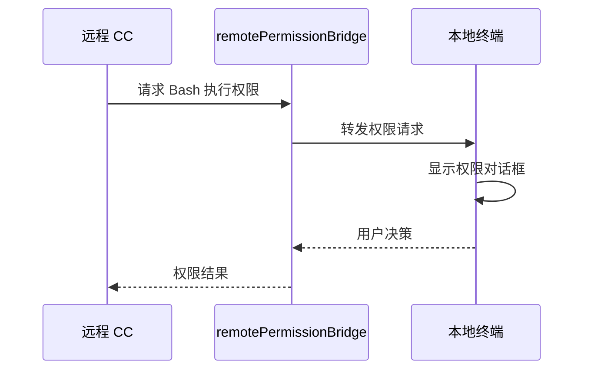

# 8.3 远程与 CCR

> 前置：[8.2 CLI/SDK 接口](/ch08-interfaces/cli-sdk)
>
> 源码位置：`src/remote/` (1127 行) + `src/server/`

CCR (Claude Code Remote) 让用户可以在远程服务器上运行 Claude Code 会话，并通过 WebSocket 从本地终端或 IDE 连接。结合 Teleport（Git Bundle 打包）和 SSH 模式，实现了完整的远程开发体验。

## 远程架构

## SessionsWebSocket

404 行的 `SessionsWebSocket.ts` 是远程会话的核心：

WebSocket 消息类型：

| 类型 | 方向 | 内容 |
|------|------|------|
| `user_input` | 客户端→服务端 | 用户输入文本 |
| `assistant_message` | 服务端→客户端 | 模型响应流 |
| `tool_result` | 服务端→客户端 | 工具执行结果 |
| `permission_request` | 服务端→客户端 | 权限请求 |
| `permission_response` | 客户端→服务端 | 权限决策 |
| `status_update` | 双向 | 状态更新 |

## RemoteSessionManager

343 行的 `RemoteSessionManager.ts` 管理会话生命周期：

| 操作 | 说明 |
|------|------|
| 创建会话 | 启动新的 Claude Code 进程 |
| 查找会话 | 按 ID 查找已有会话 |
| 列出会话 | 返回所有活跃会话 |
| 终止会话 | 优雅关闭 Claude Code 进程 |
| 重连处理 | 客户端重连时恢复会话状态 |

## 直连模式

`directConnectManager.ts` + `createDirectConnectSession.ts` 实现无需中间服务器的直连：

直连模式适用于：
- 本地网络内的机器间连接
- 开发和调试场景
- 不需要 CCR 服务器基础设施的场景

## Teleport — Git Bundle 打包

Teleport 将 Claude Code 的完整环境打包为 Git Bundle：

1. **收集上下文**：工作目录、git 历史、CLAUDE.md
2. **打包**：创建包含所有必要文件的 bundle
3. **传输**：将 bundle 传输到远程机器
4. **还原**：在远程机器上解包并启动

这确保了本地和远程环境的一致性。

## SSH 远程模式

SSH 模式通过 SSH 隧道建立远程连接：

- 在远程服务器上自动安装 Claude Code（如未安装）
- 通过 SSH 端口转发建立 WebSocket 连接
- 本地终端作为远程会话的交互界面
- 支持密钥认证和密码认证

## 远程权限桥

78 行的 `remotePermissionBridge.ts` 将远程会话的权限请求转发到本地：

这确保了用户始终在本地终端做出权限决策，即使 Claude Code 运行在远程。

## 关键源文件

| 文件 | 行数 | 职责 |
|------|------|------|
| `src/remote/SessionsWebSocket.ts` | 404 | WebSocket 会话管理 |
| `src/remote/RemoteSessionManager.ts` | 343 | 会话生命周期管理 |
| `src/remote/sdkMessageAdapter.ts` | 302 | SDK 消息格式适配 |
| `src/remote/remotePermissionBridge.ts` | 78 | 远程权限桥接 |
| `src/remote/directConnectManager.ts` | - | 直连模式管理 |
| `src/remote/createDirectConnectSession.ts` | - | 创建直连会话 |
| `src/remote/types.ts` | - | 远程模块类型定义 |

---

**下一节：[8.4 LSP 集成 →](/ch08-interfaces/lsp)**

