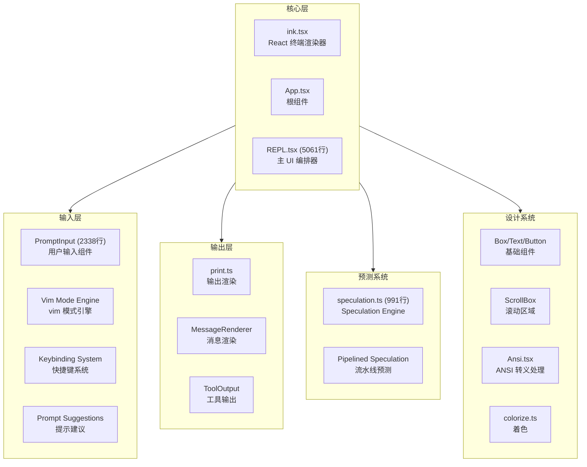
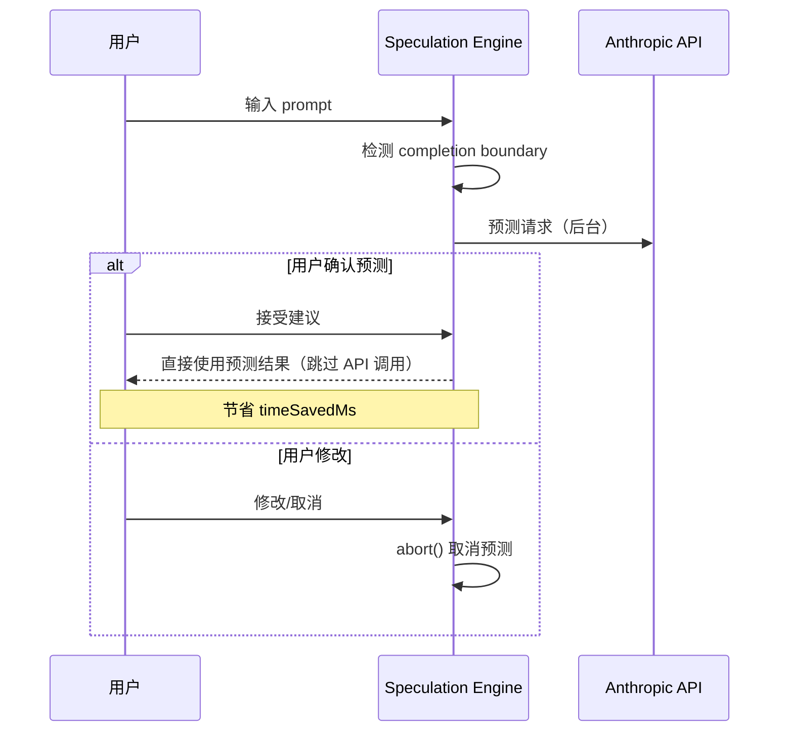

# 8.1 UI 系统

> 前置：[7.8 命令系统](/ch07-extensions/commands)
>
> 源码位置：`src/ink/` + `src/components/` + `src/hooks/`

Claude Code 的终端 UI 基于 React + Ink 构建——将 Web 组件模型映射到终端输出。REPL.tsx 是 UI 的核心编排器，而 PromptInput、Speculation、Vim 模式等子系统共同构成了完整的交互体验。

## UI 架构



## REPL.tsx — 主编排器

5061 行的 REPL.tsx 是终端 UI 的"上帝组件"，职责包括：

| 职责 | 说明 |
|------|------|
| 消息渲染 | 遍历 messages[] 渲染每条消息 |
| 工具执行展示 | 展示工具调用的实时进度和结果 |
| 权限弹窗 | 渲染权限请求对话框 |
| Speculation 管理 | 启动/取消/显示预测结果 |
| 自动模式 | 管理 auto-mode 开关和状态 |
| 命令面板 | 斜杠命令自动补全 |
| 状态栏 | 渲染底部状态栏 |
| 通知系统 | 渲染 toast 通知 |

## PromptInput — 输入组件

2338 行的 PromptInput 是最复杂的用户交互组件：

- **多行输入**：支持 Shift+Enter 换行，Enter 提交
- **自动补全**：斜杠命令、文件路径、MCP 工具名
- **历史导航**：上下箭头浏览输入历史
- **粘贴处理**：智能处理多行粘贴
- **图片输入**：支持拖拽图片到终端

## Speculation — 预测引擎

991 行的 speculation.ts 实现了"预测执行"——在用户思考时提前执行可能的下一步：



Speculation 状态机：

```typescript
type SpeculationState =
  | { status: 'idle' }
  | {
      status: 'active'
      id: string
      abort: () => void
      startTime: number
      messagesRef: { current: Message[] }
      boundary: CompletionBoundary | null
      // ...
    }
```

### Completion Boundary

预测的"完成点"定义：

| 类型 | 触发条件 | 用途 |
|------|----------|------|
| `complete` | 模型响应结束 | 完整预测命中 |
| `bash` | Bash 命令开始 | 预测命令行 |
| `edit` | 文件编辑工具调用 | 预测编辑操作 |
| `denied_tool` | 工具权限被拒 | 预测被拒情况 |

## Vim 模式引擎

Vim 模式通过 `src/commands/vim/` 实现：

- **Normal 模式**：hjkl 移动，dd 删除行，y 复制
- **Insert 模式**：正常文本输入
- **Visual 模式**：v 选择，V 行选择
- **Command 模式**：:w 保存，:q 退出

通过 keybinding 系统映射到 PromptInput 的事件处理。

## Keybinding 系统

快捷键定义支持三种形式：

1. **单键**：`ctrl+c`
2. **组合键**：`ctrl+shift+p`
3. **Chord 序列**：`ctrl+k -> ctrl+s`（先按 Ctrl+K，再按 Ctrl+S）

用户可在 `~/.claude/keybindings.json` 中自定义。

## Ink 组件库

`src/ink/components/` 提供终端 UI 基础组件：

| 组件 | 功能 |
|------|------|
| `Box.tsx` | 布局容器（类似 CSS Flexbox） |
| `Text.tsx` | 文本渲染（支持颜色/粗体） |
| `Button.tsx` | 可点击按钮 |
| `ScrollBox.tsx` | 可滚动区域 |
| `Link.tsx` | 可点击链接 |
| `Newline.tsx` | 换行 |
| `Spacer.tsx` | 弹性空白 |
| `RawAnsi.tsx` | 原始 ANSI 输出 |

## 关键源文件

| 文件 | 行数 | 职责 |
|------|------|------|
| `src/components/REPL.tsx` | 5061 | 主 UI 编排器 |
| `src/components/PromptInput.tsx` | 2338 | 用户输入组件 |
| `src/services/PromptSuggestion/speculation.ts` | 991 | Speculation 引擎 |
| `src/ink/ink.tsx` | - | React 终端渲染器 |
| `src/ink/components/` | 18 文件 | UI 基础组件库 |
| `src/ink/hooks/` | 12 文件 | 终端交互 hooks |
| `src/hooks/` | 多文件 | 业务 hooks（useCanUseTool, useSettingsChange 等） |
| `src/ink/colorize.ts` | - | 终端着色 |
| `src/ink/Ansi.tsx` | - | ANSI 转义处理 |

---

<div class="chapter-nav-hint">

**下一节：[8.2 CLI/SDK 接口 →](/ch08-interfaces/cli-sdk)**

</div>
