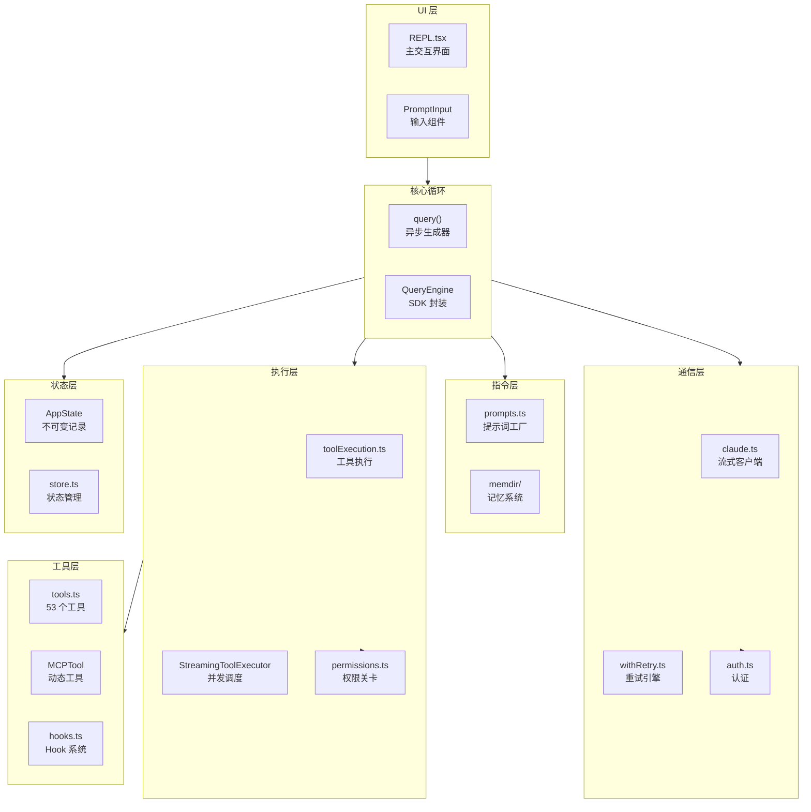
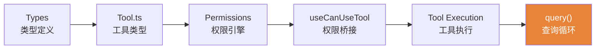
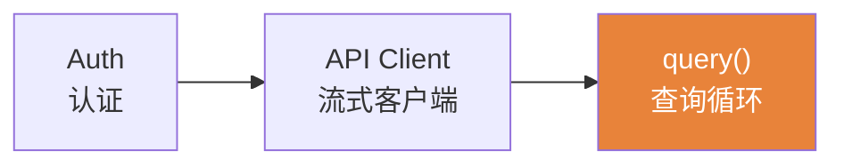
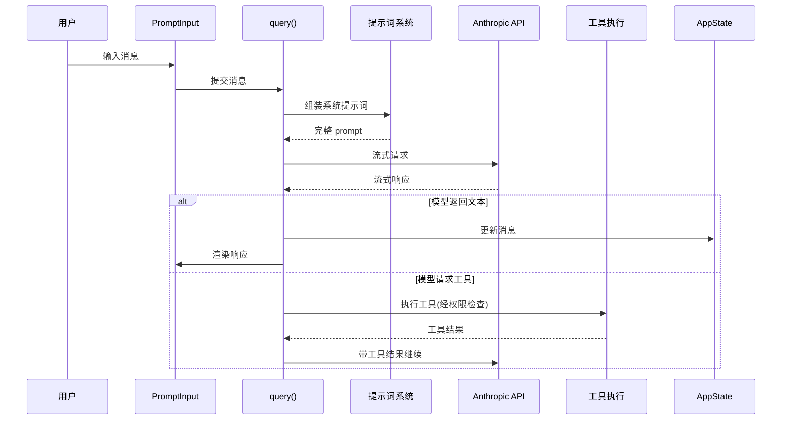

# 架构总览

> 前置：[首页项目概览](/)

Claude Code 是一个基于 React + Ink 的终端 AI 助手。它接收用户输入，组装系统提示词，调用 Anthropic API，执行模型请求的工具，然后循环往复——直到任务完成。

## 分层架构

## 核心脊柱

理解 Claude Code 最关键的一条依赖链：

加上通信链：

两条链在 `query()` 汇聚——这就是整个系统的心跳。

## 数据流全景

一次完整的用户交互流程：

## 核心系统概要

| # | 系统 | 核心文件 | 行数 | 一句话描述 |
|---|------|---------|------|-----------|
| 1 | 类型与状态 | src/types/ + src/Tool.ts + src/bootstrap/ | ~3,000 | 所有系统共用的"词汇"和"地基" |
| 2 | 认证与API | src/utils/auth/ + src/services/api/ | ~9,500 | 与 Anthropic API 通信的完整链路 |
| 3 | 权限与安全 | src/utils/permissions/ + src/utils/bash/ | ~11,000 | 工具执行前的"关卡" |
| 4 | 提示词系统 | src/constants/prompts.ts + src/memdir/ | ~3,500 | 模型收到的"大脑指令"如何组装 |
| 5 | 工具执行 | src/services/tools/ + src/utils/hooks/ | ~6,000 | 从定义到执行的完整生命周期 |
| 6 | 查询循环 | src/query.ts + src/QueryEngine.ts | ~3,000 | 全系统的汇聚点、核心循环 |
| 7 | 扩展系统 | agents/swarm/compact/mcp/plugins/skills/commands | ~50,000 | 在核心循环上叠加的 7 层扩展 |
| 8 | 外延接口 | UI/CLI-SDK/remote/LSP/entry | ~20,000 | 与外部世界的连接 |

## 技术栈

| 技术 | 用途 |
|------|------|
| TypeScript / TSX | 全量 TypeScript，ESM 模块 |
| React + Ink | 终端 UI 渲染（React 驱动终端） |
| Bun | 运行时与构建工具，`bun:bundle` 编译时特性开关 |
| Anthropic SDK | API 通信 |
| Zod | 运行时 schema 验证 |
| GrowthBook | 远程特性标志 / A-B 测试 |
| MCP SDK | Model Context Protocol 集成 |
| OpenTelemetry | 遥测追踪 |

---

**下一章：[第一章 基石 — 类型与全局状态 →](/ch01-foundation/message-types)**

你需要掌握的内容：理解 Claude Code 的类型系统（Message、Permission、Tool），以及全局引导状态（bootstrap state）如何作为所有系统的共享地基。

